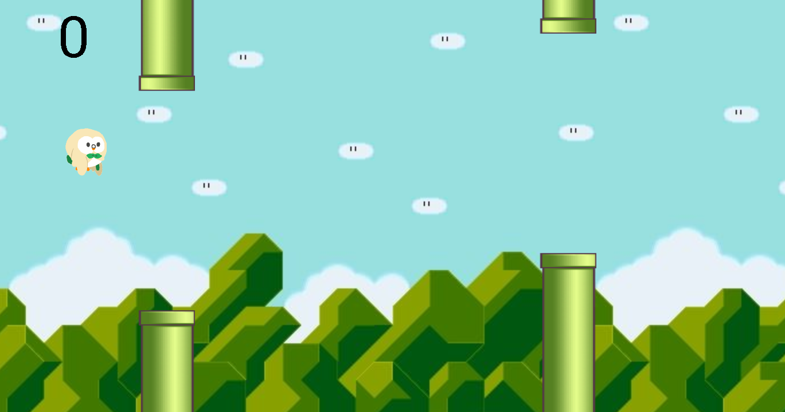

# PlayWithAnimal
Flappy Bird with Voice and Smile

## Download
[app-debug.apk](./app-debug.apk)

## Libraries
- [TarsosDSP](https://github.com/JorenSix/TarsosDSP)
  - realtime audio processing framework
- [ML Kit for Firebase](https://firebase.google.com/docs/ml-kit/)
  - Google’s machine learning package to mobile developers

## Screenshots
- flap by pitch of voice

- use smile or crying

## Contributors
- [annie31123](https://github.com/annie31123)
  - write the basic flappy bird game (use the surfaceview to draw the game animation)
- [sumfish](https://github.com/sumfish)
  - use TarsosDSP for pitch detection
- [winonecheng](https://github.com/winonecheng)
  - use ML Kit to recognize facial expressions (smiling)
